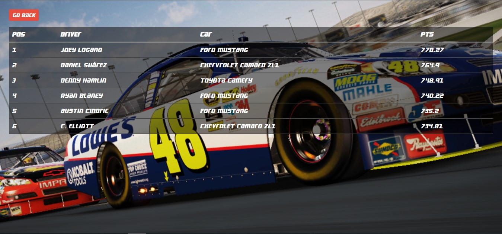
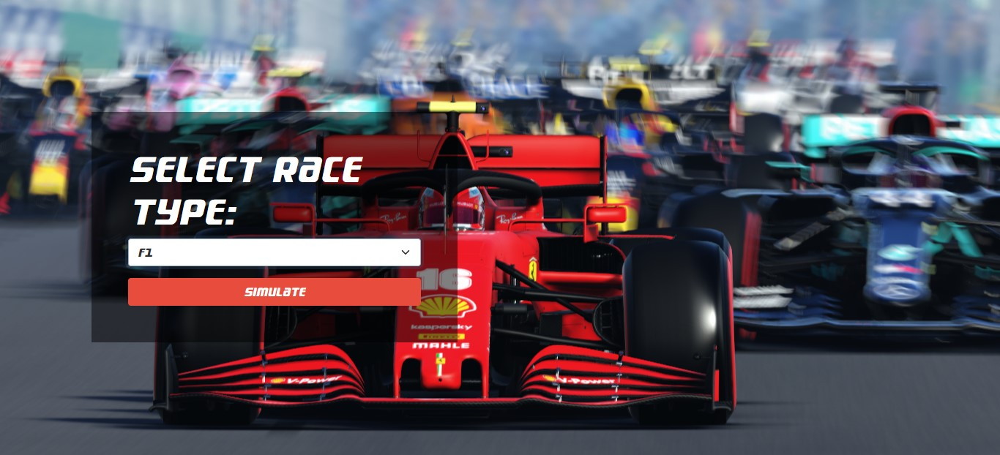
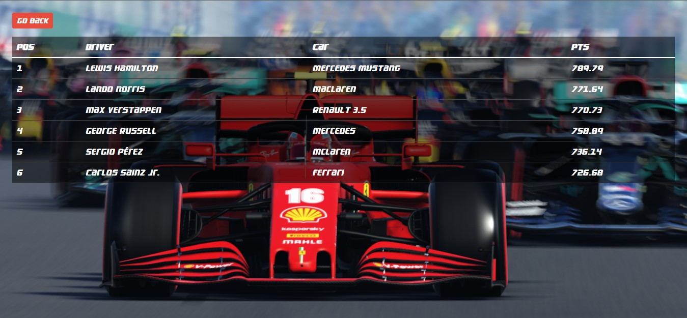

# car-racing-season-simulator
Car Racing Season Simulator (Standings and Results) using MERN stack

# Final result

# Task description

This program will simulate the results and standings of a car racing season. You can determine the kind of car racing, NASCAR, F1, GT etc. You will need Drivers with some skill attributes. You will need cars from various manufacturers. The cars would have various horse power and attributes. The season will have a qualifying event to eliminate some drivers. The season will have many races with results. The season will have a final championship race.

Functional Requirements:
1.	The UI should display the teams and driver standings, who qualified for the season and each race results with the championship results.
2.	The UI should have a "Simulate Season" button that runs the race and returns the standings of the season.
3.	Use your creativity, what other things would you add to affect the outcome of the race season? Breakdowns? Crashes? How does your algorithm determine winners?
4.	The UI should display the season results and championship.

Technical Requirements:
1.	Simple UI demonstrating knowledge of CSS.
2.	React front end that queries NodeJS backend
3.	No Authorization required on the Node side
4.	No DB is required, your data could exist in Node code.
5.	Use of Components in React
6.	Use of Controllers in Node
7.	Please provide the source code and the URL of an operating URL.
